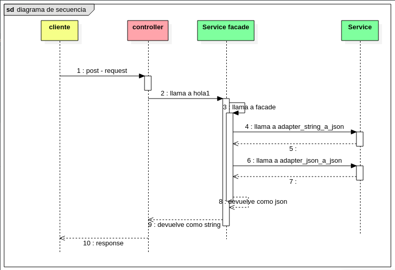

# Reto tecnico Entelgy
- Desarrollar un programa que re-formate la estructura json: (las lineas suspensivas indican que hay ___n___ elementos en la lista)

de este formato 
```json
{
    "page": 1,
    "per_page": 6,
    "total": 12,
    "total_pages": 2,
    "data": [
        {
            "id": 1,
            "email": "george.bluth@reqres.in",
            "first_name": "George",
            "last_name": "Bluth",
            "avatar": "https://reqres.in/img/faces/1-image.jpg"
        },
        ... <============== mas elementos
    ],
    "support": {
        "url": "https://reqres.in/#support-heading",
        "text": "To keep ReqRes free, contributions towards server costs are appreciated!"
    }
}
```
a este formato
```json
{
  "data": [
    "1|Bluth|george.bluth@reqres.in",
    ... <============== mas elementos
  ]
}
```
- el json a formatear debe de consumirse de la siguiente URL https://reqres.in/api/users. Esta debe ser consumida desde el archvo properties del backend.
- Tambien se solicita que se aplique testeo de las funciones.

# Estructura del proyecto
```
|-- reto-tecnico-entelgy (repositorio)
    |-- README.md (documentacion)
    |-- reto-tecnico (backend)
        |-- pom.xml (dependencias del proyecto)
        |-- src
            |-- main/java/com/entelgy/retotecnico
                |-- RetoController (controllador)
                |-- RetoService (servicio)
            |-- test/java/com/entelgy/retotecnico
                |-- RetoTecnicoApplicationTests.java (teseo junit)
```
# spring
[enlace](https://anchormen.nl/blog/big-data-services/spring-boot-tutorial/)


# funcionamiento
- el cliente envia un post con su respectivo request
- el controller recibe el request en forma de string y se lo pasa al service

- el service evalua si si el cuepo tiene el formato correcto 
```json
{
    "accion":"si"
}
```
- la capa controller recibe el request y se lo envia a las funciones facade de la capa servicio.
- si todo esta ok, la capa servicio se encarga
- aqui se valida que el request enviado por el cliente tiene el siguiente formato
- de estar bien, las funciones de la ca

# Despliegue
```bash
cd (ubicacion del repo)/reto-tecnico-entelgy/reto-tecnico
./mvnw spring-boot:run
```
# Referencia
- Spring initializer [link](https://start.spring.io/)
- Guias oficiales de spring [link](https://spring.io/guides)

# testing